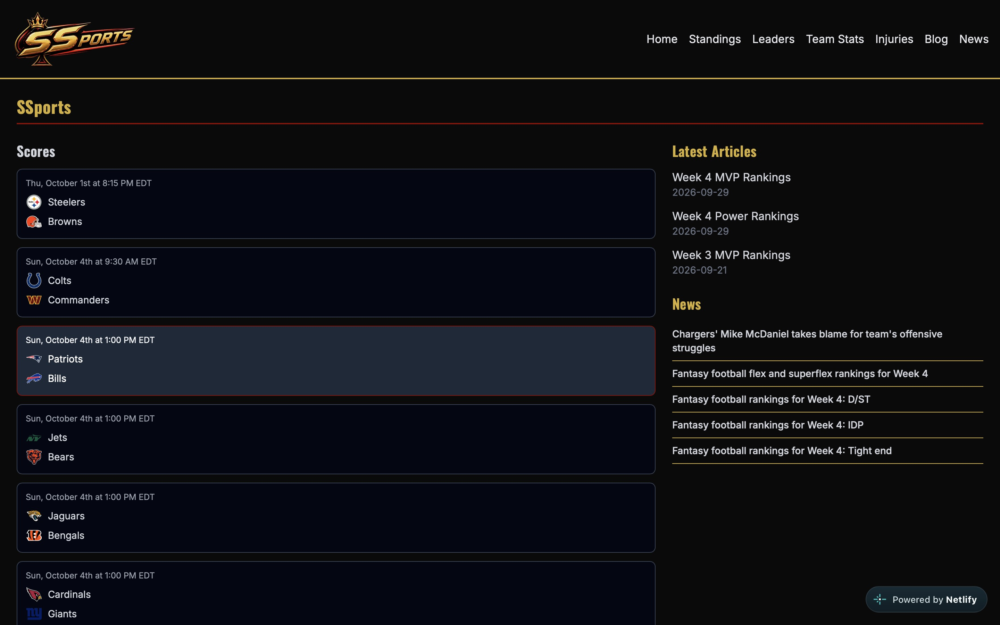
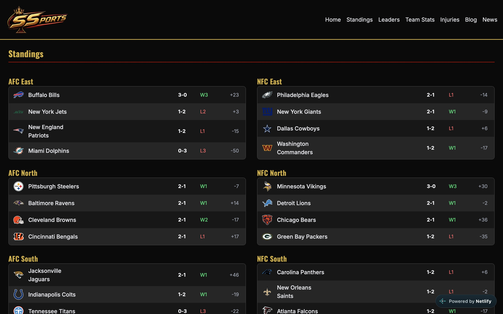
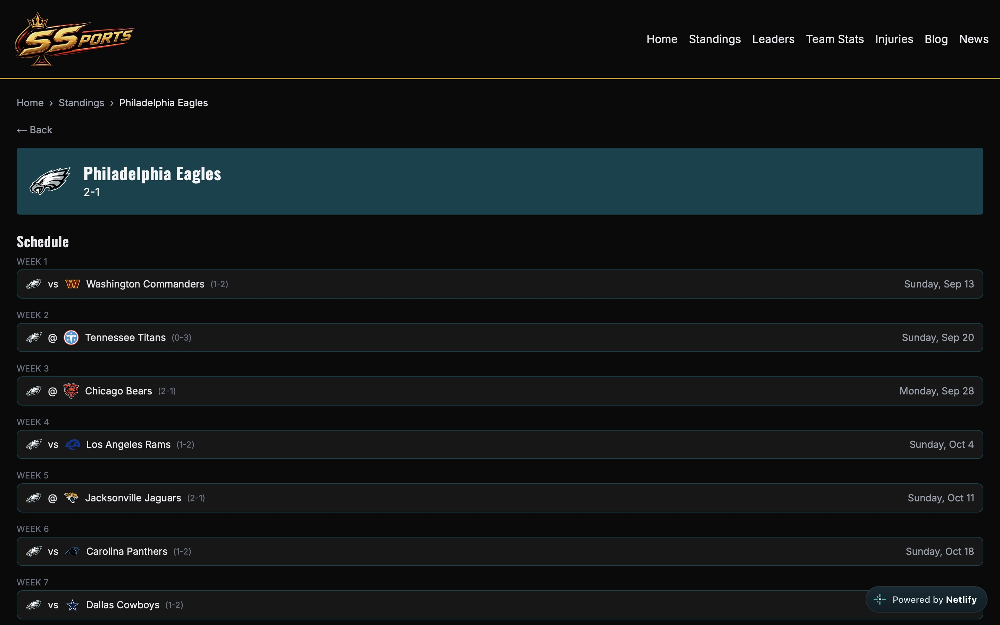
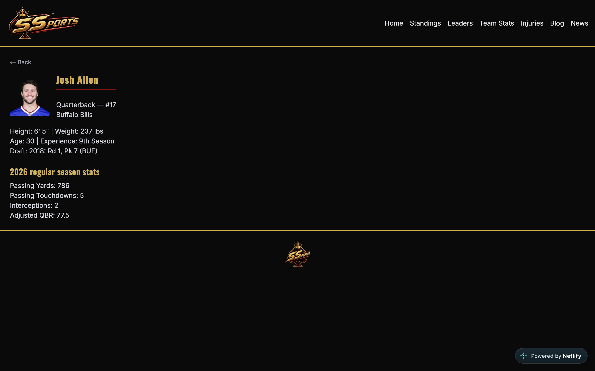
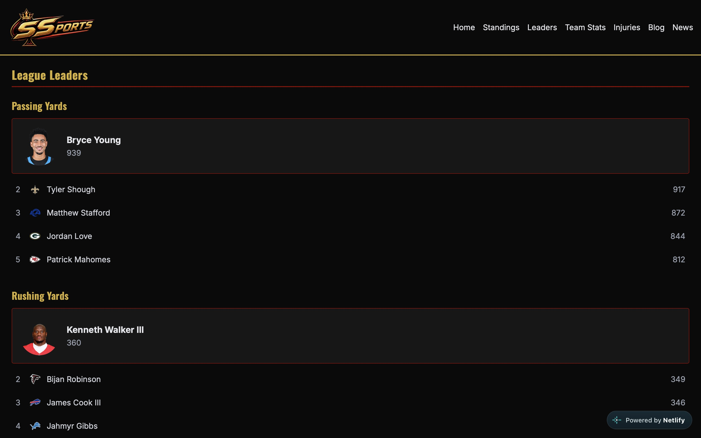
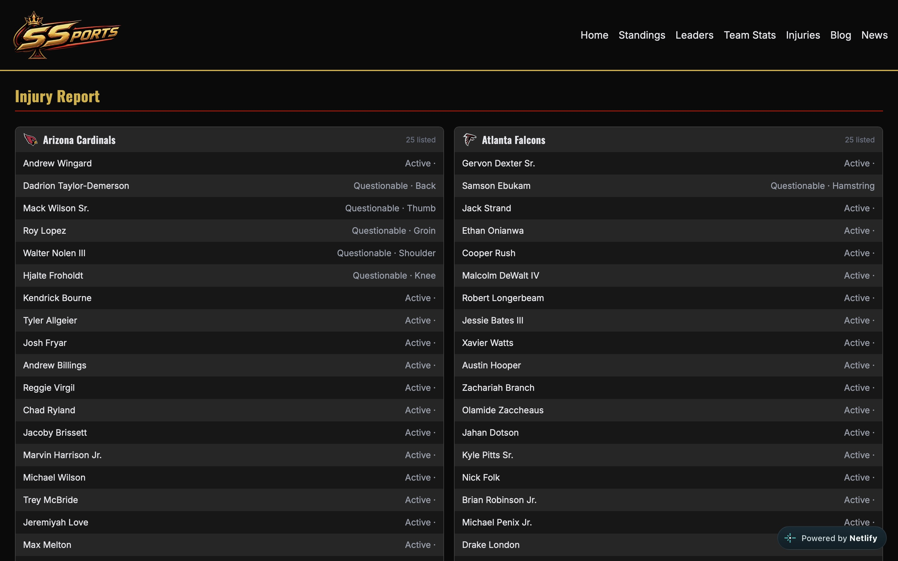
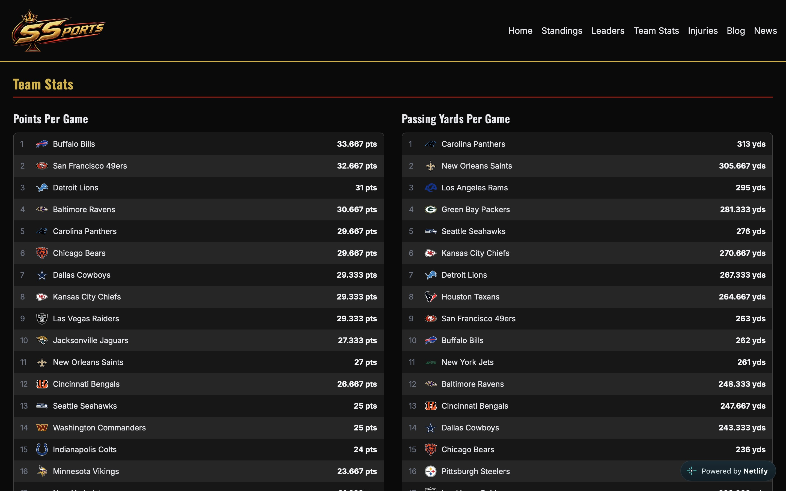
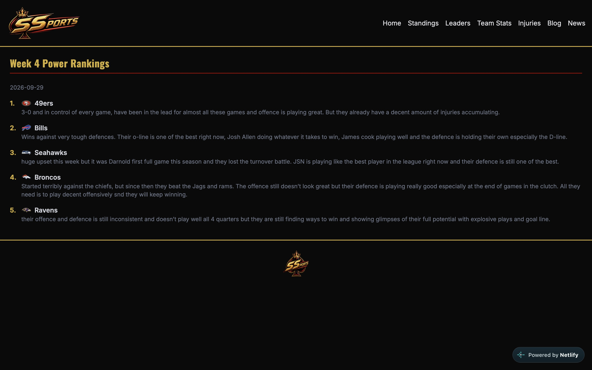
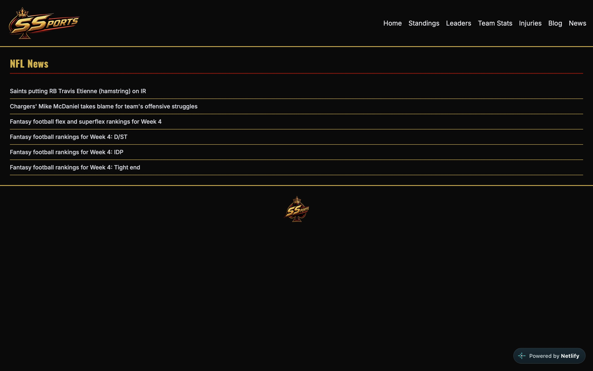

# 🏈 SSports

A full-stack NFL companion site — live scores, standings, league leaders, team/player pages with depth charts, box scores, injury reports, and a custom blog for weekly power & MVP rankings.

**[Live Demo](https://s-sports.netlify.app/)** · **[GitHub](https://github.com/Spencer1923/SSports)**

## What I Built

SSports is a Next.js app that consumes ESPN's public API to deliver a real-time NFL fan experience — scores, standings, player/team stats, and injury reports — alongside a hand-written blog for weekly rankings and analysis. I designed and built the full data layer (API routes proxying and reshaping ESPN's endpoints), dynamic routing for every team/player/game, and a custom dark gold/crimson UI theme from scratch.

**Highlights:**
- Live scoreboard with auto-refresh and score-change animations
- Dynamic team pages: schedule, roster, and depth chart (merged from separate API endpoints)
- Player pages with season stats pulled live from ESPN
- League leaderboards (passing, rushing, defense, etc.) and team-stat leaderboards (offense, takeaways, etc.)
- Weekly blog posts (Markdown/MDX) for power rankings and MVP rankings, with player headshots and team logos
- Fully responsive, mobile-friendly navigation

## Screenshots

<!-- Add screenshots here, e.g.: -->










## Tech Stack

- **Framework:** Next.js (App Router)
- **Styling:** Tailwind CSS
- **Data:** ESPN's public API (scores, standings, stats, injuries, depth charts)
- **Content:** Markdown/MDX for blog posts
- **Deployment:** Netlify

## Features

| Page | Description |
|---|---|
| `/` | Live scores + latest blog posts hub |
| `/standings` | AFC/NFC standings by division |
| `/leaders` | League statistical leaders (top 5 per category) |
| `/team-stats` | Team-level offense/defense leaderboards |
| `/teams/[id]` | Team schedule, depth chart, and roster |
| `/players/[id]` | Player bio and season stats |
| `/games/[id]` | Full box score with team and player stats |
| `/injuries` | League-wide injury report |
| `/blog` | Weekly power rankings and MVP rankings |

## Getting Started

```bash
git clone https://github.com/Spencer1923/SSports.git
cd SSports
npm install
npm run dev
```

Open [http://localhost:3000](http://localhost:3000).

## What I Learned

Building SSports involved working with undocumented/reverse-engineered API endpoints, which meant handling inconsistent data shapes, missing fields, and designing resilient fallback logic. I also built a cohesive design system (custom color theming without a Tailwind config file, reusable card/table layouts) and solved real UX problems like mobile navigation and depth-chart data merging across multiple API calls.